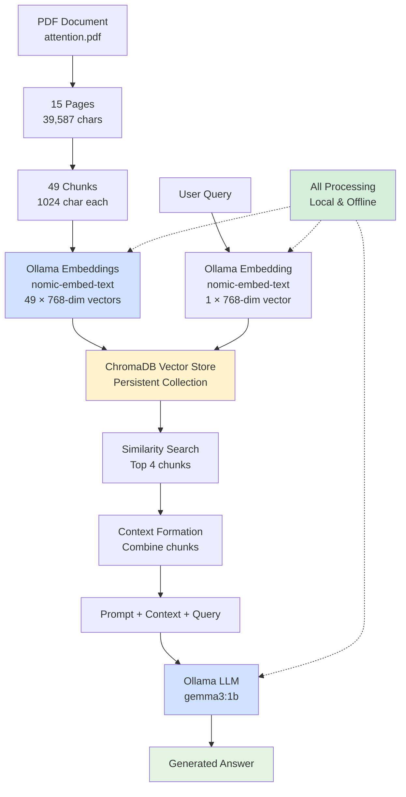
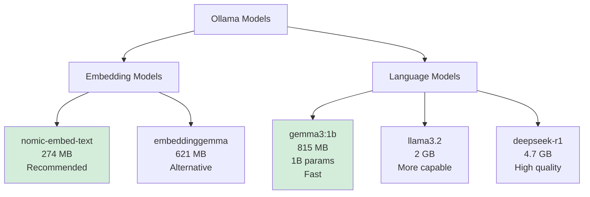

# Local RAG with Ollama - Fully Offline Workflow

## Overview
This workflow demonstrates a fully **offline** RAG (Retrieval-Augmented Generation) system using Ollama for local embeddings and language models, with ChromaDB for vector storage. No internet connection required after initial setup.

## Complete RAG Pipeline

```mermaid
graph TB
    Start([Start RAG Pipeline]) --> OllamaCheck{Ollama<br/>Installed?}

    OllamaCheck -->|No| InstallOllama[Install Ollama<br/>Download from ollama.com]
    OllamaCheck -->|Yes| PullModels[Pull Required Models<br/>ollama pull commands]

    InstallOllama --> PullModels

    PullModels --> ModelList[Models Downloaded:<br/>- nomic-embed-text 274MB<br/>- gemma3:1b 815MB]

    ModelList --> LocalReady[Local System Ready<br/>No Internet Needed]

    LocalReady --> DocLoad[Document Loading<br/>PyPDFLoader]

    DocLoad --> PDFInput[Input: attention.pdf<br/>15 pages, 39,587 characters]

    PDFInput --> DocObjects[Document Objects Created<br/>Each page = 1 Document<br/>with metadata]

    DocObjects --> TextSplit[Text Splitting<br/>RecursiveCharacterTextSplitter]

    TextSplit --> SplitConfig[Configuration:<br/>- Chunk Size: 1024<br/>- Chunk Overlap: 128<br/>- Split Order: \\n\\n → \\n → sentence → word]

    SplitConfig --> Chunks[49 Text Chunks Created<br/>From 15 pages]

    Chunks --> EmbedGen[Generate Embeddings<br/>Ollama Local Processing]

    EmbedGen --> EmbedModel[Model: nomic-embed-text<br/>Dimension: 768<br/>Size: 274 MB<br/>Runs on CPU/GPU]

    EmbedModel --> LocalProcessing1{Processing<br/>Location}

    LocalProcessing1 -->|Local Machine<br/>Offline| Vectors[49 Vector Embeddings<br/>Each 768-dimensional]

    Vectors --> VectorStore[Vector Storage<br/>ChromaDB]

    VectorStore --> ChromaConfig[ChromaDB Configuration:<br/>- Local persistent storage<br/>- Path: ./chroma_db<br/>- Collection: local_rag_collection<br/>- Better Python 3.13 support]

    ChromaConfig --> SaveDB[Save Collection to Disk<br/>Can reload without reprocessing]

    SaveDB --> Ready[System Ready for Queries<br/>100% Offline]

    Ready --> UserQuery[User Query Input]

    UserQuery --> Retriever[ChromaDB Retriever<br/>Similarity Search]

    Retriever --> SearchConfig[Search Configuration:<br/>- Type: Similarity cosine<br/>- k = 4 top chunks<br/>- Method: invoke<br/>- All local processing]

    SearchConfig --> TopChunks[Retrieve Top 4<br/>Most Relevant Chunks]

    TopChunks --> FormatDocs[Format Documents<br/>Combine chunks with \\n\\n]

    FormatDocs --> Context[Context Created<br/>from Retrieved Chunks]

    Context --> PromptTemplate[ChatPromptTemplate<br/>System + Human Messages]

    PromptTemplate --> PromptStructure[Template Structure:<br/>System: Answer based on context<br/>Context: Retrieved chunks<br/>Question: User query]

    PromptStructure --> LLMCall[Local LLM Processing<br/>Ollama]

    LLMCall --> LLMConfig[Model: gemma3:1b<br/>Size: 815 MB<br/>Parameters: 1 billion<br/>Temperature: 0<br/>Runs on CPU/GPU]

    LLMConfig --> LocalProcessing2{Processing<br/>Location}

    LocalProcessing2 -->|Local Machine<br/>Offline| LLMResponse[LLM Generates Answer<br/>Based on Context]

    LLMResponse --> ParseOutput[String Output Parser<br/>Extract text response]

    ParseOutput --> FinalAnswer([Final Answer to User<br/>All Offline])

    style Start fill:#e1f5e1
    style FinalAnswer fill:#e1f5e1
    style LocalProcessing1 fill:#d4edda
    style LocalProcessing2 fill:#d4edda
    style EmbedModel fill:#cfe2ff
    style LLMConfig fill:#cfe2ff
    style VectorStore fill:#fff3cd
    style Retriever fill:#fff3cd
    style Ready fill:#d4edda
```



## LCEL Chain Architecture


## Data Flow Summary



## Ollama Model Options



## Key Components

### Building Blocks

1. **Ollama Setup**
   - Install: Download from ollama.com
   - Pull models: `ollama pull nomic-embed-text` and `ollama pull gemma3:1b`
   - One-time setup, then fully offline

2. **Document Loading**
   - Tool: PyPDFLoader
   - Input: PDF files
   - Output: Document objects with metadata
   - Same as cloud version

3. **Text Splitting**
   - Tool: RecursiveCharacterTextSplitter
   - Strategy: Hierarchical splitting (paragraphs → lines → sentences)
   - Parameters: 1024 chunk size, 128 overlap
   - Same as cloud version

4. **Embeddings**
   - Provider: Ollama (Local)
   - Model: nomic-embed-text
   - Dimension: 768 (smaller than OpenAI)
   - **No internet required**
   - Processing: Local CPU/GPU

5. **Vector Storage**
   - Tool: ChromaDB
   - Storage: Local persistent collection
   - Path: ./chroma_db
   - Collection: local_rag_collection
   - Better Python 3.13 compatibility

6. **Retrieval**
   - Method: Similarity search (cosine)
   - Top-k: 4 chunks
   - Interface: LangChain retriever
   - **All local processing**

7. **Language Model**
   - Provider: Ollama (Local)
   - Model: gemma3:1b (1 billion parameters)
   - Size: 815 MB
   - Temperature: 0 (deterministic)
   - **No internet required**
   - Processing: Local CPU/GPU

8. **Framework**
   - LangChain 1.0+ with LCEL
   - Pipe operators for chain composition
   - Same architecture as cloud version

## Initial Setup Commands

```bash
# Install Ollama (one-time)
# Visit ollama.com and download for your OS

# Pull embedding model (one-time, 274 MB)
ollama pull nomic-embed-text

# Pull LLM model (one-time, 815 MB)
ollama pull gemma3:1b

# Optional: Pull alternative models
ollama pull embeddinggemma  # 621 MB
ollama pull llama3.2        # 2 GB
ollama pull deepseek-r1     # 4.7 GB
```

## Dependencies

- langchain
- langchain-core
- langchain-ollama
- langchain-chroma
- chromadb
- pypdf
- ollama (system installation)

## Advantages

- **100% Offline** - No internet needed after setup
- **Privacy** - Data never leaves your machine
- **No API Costs** - Free after model download
- **Full Control** - Choose your own models
- **Python 3.13 Compatible** - ChromaDB works well
- **No Rate Limits** - Process as much as you want

## Considerations

- Initial model downloads required (one-time)
- Quality may be lower than GPT-4 (depending on model)
- Requires local compute resources (CPU/GPU)
- Slower inference than cloud APIs (depends on hardware)
- Need to manage Ollama service

## Privacy & Security

- All data processing happens locally
- No data sent to external servers
- Ideal for sensitive documents
- Complete control over your data
- GDPR/compliance friendly
