# RAG Implementation Comparison: Cloud vs Local

## Overview
This document compares the two RAG implementations: cloud-based (OpenAI) vs fully local (Ollama).

## Side-by-Side Architecture Comparison

## Detailed Feature Comparison

```mermaid
graph TD
    Compare[RAG Implementations]

    Compare --> Embedding[Embedding Generation]
    Compare --> Storage[Vector Storage]
    Compare --> Model[Language Model]
    Compare --> Infra[Infrastructure]

    Embedding --> E_Cloud[Cloud: OpenAI<br/>text-embedding-3-small<br/>1536 dims<br/>$0.00002/1K tokens]
    Embedding --> E_Local[Local: Ollama<br/>nomic-embed-text<br/>768 dims<br/>Free]

    Storage --> S_Cloud[Cloud: FAISS<br/>Local index<br/>Fast similarity search<br/>./faiss_index]
    Storage --> S_Local[Local: ChromaDB<br/>Persistent collection<br/>Python 3.13 compatible<br/>./chroma_db]

    Model --> M_Cloud[Cloud: GPT-4-Turbo<br/>Highly capable<br/>API costs apply<br/>2000 max tokens]
    Model --> M_Local[Local: gemma3:1b<br/>1B parameters<br/>815 MB<br/>Free]

    Infra --> I_Cloud[Cloud Infrastructure:<br/>✓ Internet required<br/>✓ API keys needed<br/>✗ Data sent externally<br/>✓ Easy setup]
    Infra --> I_Local[Local Infrastructure:<br/>✓ Fully offline<br/>✓ No API keys<br/>✓ Data stays local<br/>✗ More setup needed]

    style E_Cloud fill:#e1f0ff
    style M_Cloud fill:#e1f0ff
    style E_Local fill:#cfe2ff
    style M_Local fill:#cfe2ff
    style I_Cloud fill:#ffe1e1
    style I_Local fill:#d4edda
```

## Decision Matrix

## Component-by-Component Comparison Table

| Component | Cloud RAG (simple_rag_langchain) | Local RAG (local_rag_ollama) |
|-----------|----------------------------------|------------------------------|
| **Document Loading** | PyPDFLoader | PyPDFLoader ✓ Same |
| **Text Splitting** | RecursiveCharacterTextSplitter 1024/128 | RecursiveCharacterTextSplitter 1024/128 ✓ Same |
| **Embedding Model** | OpenAI text-embedding-3-small | Ollama nomic-embed-text |
| **Embedding Dimension** | 1536 | 768 |
| **Embedding Cost** | $0.00002 per 1K tokens | Free |
| **Vector Store** | FAISS | ChromaDB |
| **Storage Path** | ./faiss_index | ./chroma_db |
| **Retrieval Method** | Similarity search, k=4 | Similarity search, k=4 ✓ Same |
| **LLM Provider** | OpenAI API | Ollama Local |
| **LLM Model** | GPT-4-Turbo | gemma3:1b (1B params) |
| **LLM Quality** | Excellent | Good |
| **Temperature** | 0 | 0 ✓ Same |
| **Framework** | LangChain LCEL | LangChain LCEL ✓ Same |
| **Internet Required** | Yes (embeddings + LLM) | No (fully offline) |
| **Privacy** | Data sent to OpenAI | Data stays local |
| **Setup Complexity** | Low (just API key) | Medium (install Ollama) |
| **Running Cost** | Pay per request | Free after download |
| **Python 3.13** | FAISS warnings | ChromaDB compatible |

## Data Flow Comparison

## Cost Analysis

## Performance Comparison

## Use Case Recommendations

## Migration Path

## Common Elements (Same in Both)

Both implementations share these components:

1. **Document Processing**
   - PyPDFLoader for PDF loading
   - Same document structure

2. **Text Splitting**
   - RecursiveCharacterTextSplitter
   - Chunk size: 1024, Overlap: 128
   - Same splitting strategy

3. **Retrieval**
   - Similarity search (cosine)
   - Top k=4 chunks
   - Same retrieval logic

4. **Framework**
   - LangChain 1.0+
   - LCEL chain composition
   - Same pipeline structure

5. **Prompt Template**
   - Same template format
   - System + context + question
   - Same instruction style

6. **Temperature**
   - Both use temperature=0
   - Deterministic responses
   - Factual answers

## Key Takeaways

### Cloud RAG (simple_rag_langchain.ipynb)
- **Best for:** Production apps, highest quality needed, have budget
- **Pros:** Excellent quality, easy setup, well-tested
- **Cons:** Costs money, needs internet, privacy concerns

### Local RAG (local_rag_ollama.ipynb)
- **Best for:** Privacy-critical, offline use, no budget
- **Pros:** Free, private, offline, full control
- **Cons:** More setup, quality varies by model, needs local resources

### The Choice
Both implementations use the same fundamental RAG architecture. The main difference is **where the computation happens** (cloud vs local). You can easily switch between them by changing just a few lines of code, making it possible to:

1. Start with local for development
2. Test with cloud for comparison
3. Use hybrid approaches (local embeddings, cloud LLM)
4. Choose based on specific requirements

The modular design of LangChain makes this flexibility possible!
