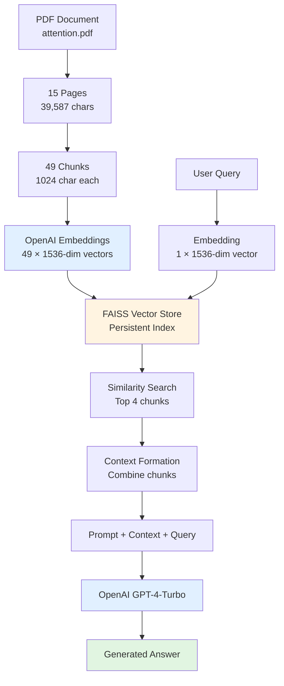

# Simple RAG with LangChain - Cloud-based Workflow

## Overview
This workflow demonstrates a cloud-based RAG (Retrieval-Augmented Generation) system using OpenAI's APIs for embeddings and language models, with FAISS for vector storage.

## Complete RAG Pipeline

```mermaid
graph TB
    Start([Start RAG Pipeline]) --> LoadEnv[Load Environment Variables<br/>OpenAI API Key from .env]

    LoadEnv --> DocLoad[Document Loading<br/>PyPDFLoader]

    DocLoad --> PDFInput[Input: attention.pdf<br/>15 pages, 39,587 characters]

    PDFInput --> DocObjects[Document Objects Created<br/>Each page = 1 Document<br/>with metadata]

    DocObjects --> TextSplit[Text Splitting<br/>RecursiveCharacterTextSplitter]

    TextSplit --> SplitConfig[Configuration:<br/>- Chunk Size: 1024<br/>- Chunk Overlap: 128<br/>- Split Order: \\n\\n → \\n → sentence → word]

    SplitConfig --> Chunks[49 Text Chunks Created<br/>From 15 pages]

    Chunks --> EmbedGen[Generate Embeddings<br/>OpenAI API Call]

    EmbedGen --> EmbedModel[Model: text-embedding-3-small<br/>Dimension: 1536<br/>Cost: $0.00002/1K tokens]

    EmbedModel --> CloudAPI1{Internet<br/>Connection<br/>Required}

    CloudAPI1 -->|Yes| Vectors[49 Vector Embeddings<br/>Each 1536-dimensional]

    Vectors --> VectorStore[Vector Storage<br/>FAISS Index]

    VectorStore --> FAISSConfig[FAISS Configuration:<br/>- Local storage<br/>- Path: ./faiss_index<br/>- Persistent]

    FAISSConfig --> SaveIndex[Save Index to Disk<br/>Can reload without reprocessing]

    SaveIndex --> Ready[System Ready for Queries]

    Ready --> UserQuery[User Query Input]

    UserQuery --> Retriever[FAISS Retriever<br/>Similarity Search]

    Retriever --> SearchConfig[Search Configuration:<br/>- Type: Similarity cosine<br/>- k = 4 top chunks<br/>- Method: invoke]

    SearchConfig --> TopChunks[Retrieve Top 4<br/>Most Relevant Chunks]

    TopChunks --> FormatDocs[Format Documents<br/>Combine chunks with \\n\\n]

    FormatDocs --> Context[Context Created<br/>from Retrieved Chunks]

    Context --> PromptTemplate[ChatPromptTemplate<br/>System + Human Messages]

    PromptTemplate --> PromptStructure[Template Structure:<br/>System: Answer based on context<br/>Context: Retrieved chunks<br/>Question: User query]

    PromptStructure --> LLMCall[LLM API Call<br/>OpenAI ChatGPT]

    LLMCall --> LLMConfig[Model: gpt-4-turbo-2024-04-09<br/>Temperature: 0<br/>Max Tokens: 2000]

    LLMConfig --> CloudAPI2{Internet<br/>Connection<br/>Required}

    CloudAPI2 -->|Yes| LLMResponse[LLM Generates Answer<br/>Based on Context]

    LLMResponse --> ParseOutput[String Output Parser<br/>Extract text response]

    ParseOutput --> FinalAnswer([Final Answer to User])

    style Start fill:#e1f5e1
    style FinalAnswer fill:#e1f5e1
    style CloudAPI1 fill:#ffe1e1
    style CloudAPI2 fill:#ffe1e1
    style EmbedModel fill:#e1f0ff
    style LLMConfig fill:#e1f0ff
    style VectorStore fill:#fff4e1
    style Retriever fill:#fff4e1
```

## LCEL Chain Architecture

## Data Flow Summary

## Key Components

### Building Blocks

1. **Document Loading**
   - Tool: PyPDFLoader
   - Input: PDF files
   - Output: Document objects with metadata

2. **Text Splitting**
   - Tool: RecursiveCharacterTextSplitter
   - Strategy: Hierarchical splitting (paragraphs → lines → sentences)
   - Parameters: 1024 chunk size, 128 overlap

3. **Embeddings**
   - Provider: OpenAI API
   - Model: text-embedding-3-small
   - Dimension: 1536
   - **Requires: Internet connection**

4. **Vector Storage**
   - Tool: FAISS (Facebook AI Similarity Search)
   - Storage: Local persistent index
   - Path: ./faiss_index

5. **Retrieval**
   - Method: Similarity search (cosine)
   - Top-k: 4 chunks
   - Interface: LangChain retriever

6. **Language Model**
   - Provider: OpenAI API
   - Model: GPT-4-Turbo
   - Temperature: 0 (deterministic)
   - **Requires: Internet connection**

7. **Framework**
   - LangChain 1.0+ with LCEL
   - Pipe operators for chain composition

## Dependencies

- langchain
- langchain-core
- langchain-openai
- langchain-community
- faiss-cpu
- pypdf
- tiktoken
- python-dotenv

## Advantages

- High-quality embeddings and responses
- Well-tested OpenAI models
- Simple setup (just API key needed)
- Good documentation and support

## Considerations

- Requires internet connection
- API costs per request
- Data sent to OpenAI (privacy consideration)
- Rate limits apply
